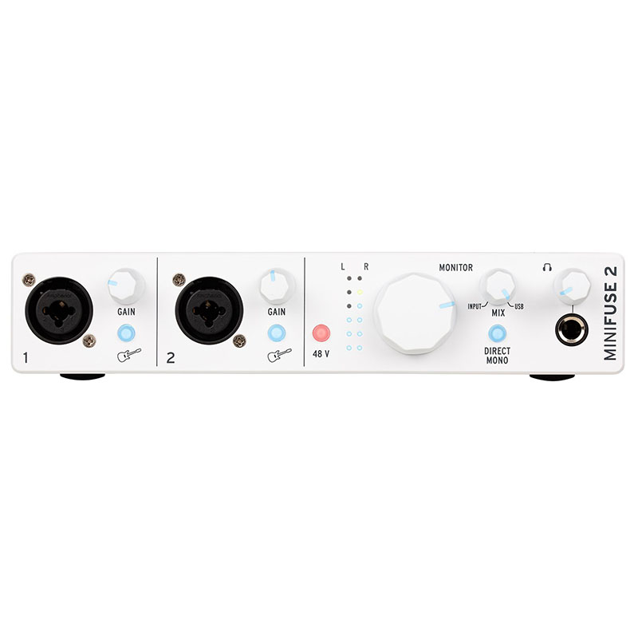

Chào mọi người, trong bài blog này, mình sẽ giới thiệu về các thiết bị mình hiên dùng để nghe nhạc.

Mình sẽ chia bài viết thành 2 phần chính: phần 1 là thiết bị dùng để stream nhạc, phần 2 là thiết bị dùng để nghe nhạc offline.

# Phần 1: Tai nghe của mình 

Tai nghe hiện tại mình đang sử dụng là chiếc Blon BL03, mình đã mua chiếc tai nghe được 1 tháng rồi, và đến nay nó vẫn sử dụng tốt.

Nhưng mình đã thay đổi một số phụ kiện cho chiếc tai nghe này, đó là dây cáp và ear tips.

Đối với dây cáp, mình đã thay dây cáp của chiếc tai nghe này bằng dây cáp của Tripowin Zoe (4 core), mình thấy dây cáp này chất lượng hơn so với dây cáp mặc định của Blon BL03.

Còn với ear tips, mình đã thay ear tips của Blon BL03 bằng ear tips của SpinFit Omni, mình thấy ear tips này ôm tai hơn và đem lại tiếng bass sâu hơn.

Không biết mọi người ra sao, nhưng đối với eartips, mình phải mua tới tận 2 set với 2 size khác nhau, mới có thể chọn được size phù hợp với tai của mình.

# Phần 2: Stream nhạc
Đối với việc stream nhạc, mình sẽ dùng hai thiết bị chính, là laptop và điện thoại.

## Laptop:
Máy mình hiên đang sử dụng làm daily driver là MacBook Pro (14-inch, 2023, M3 Pro). Đây là thiết bị mình dùng để vừa code, vừa nghe nhạc.

Nếu như các bạn chưa biết, thì chiếc MacBook Pro này hỗ trợ giải mã âm thanh lên đến 24-bit/192kHz, nên việc nghe nhạc trên máy này thực sự rất tuyệt.

Trước đây, khi mình nghe nhạc trên chiếc MacBook Air (2017) của mình. Mình phải dùng qua một chiếc Audio Interface ngoài, là Arturia MiniFuse 2, 
mình vẫn đang sử dụng MiniFuse 2 với chiếc MacBook Pro hiện tại của mình, nhưng mình chỉ dùng khi cần ghi âm (từ mic, qua cổng XLR hoặc 6.5mm).

MiniFuse 2: Ảnh của Vietthuongmusic

Đối với nền tảng stream nhạc, thì mình sử dụng cả Spotify và Apple Music. Mình chỉ sử dụng Spotify khi cần nghe cùng bạn bè qua Discord. 
Còn lại, mình sẽ sử dụng Apple Music (tại Apple Music sẽ cung cấp chất lượng âm thanh Lossless và Hi-Res Lossless).

Không chỉ 2 chất lượng ấy, Apple Music còn cung cấp tính năng Spatial Audio (âm thanh không gian). Mình thường dùng tính năng này khi nghe nhạc với chiếc
AirPods Pro 2 của mình.

## Điện thoại:
Chiếc điện thoại mình đang sử dụng là iPhone 12. Mình thường dùng iPhone để nghe nhạc khi đi gym, đi xe đạp hoặc đi chạy. 

Riêng đối với điện thoại, mình thường nghe nhạc qua tai nghe không dây, là chiếc AirPods Pro 2. Mình thấy chiếc tai nghe này rất tiện lợi khi đi ra ngoài.

Còn lúc mình cần stream những bài nhạc mới, mà chưa có cơ hội để tải về nghe offline, mình sẽ dùng cáp Lightning to 3.5mm để kết nối với em Blon của mình.

# Phần 3: Nghe nhạc offline 

## Thiết bị: 

Đây có lẽ là phần hấp dẫn nhất trong setup nghe nhạc của mình.

Thiết bị mình đang sử dụng là chiếc iPod Classic 5.5 Gen (256GB). 

Chiếc iPod này đã được mod lại bằng cách thay ổ cứng, thay front plate, mod pin lên 1700mah và cài đặt Rockbox.

Ngoài chiếc Classic này, mình còn sử dụng một chiếc iPod Nano Gen 2 (8GB) để nghe nhạc mỗi khi cần sự gọn nhẹ.

Đối với cả 2 chiếc iPod kia, mình đều sử dụng chiếc Blon của mình ở trên để nghe nhạc.

## Phần mềm:

Hiện mình đang sử dụng Rockbox để nghe nhạc trên iPod. 

Khi cài đặt Rockbox, mình có thể tận hưởng được chất lượng audio lossless, do Rockbox hỗ trợ các file nhạc FLAC, AIFF, v.v.
Không chỉ vậy, Rockbox còn hỗ trợ sample rate cao hơn so với firmware mặc định của iPod.

Trên Rockbox, hiện mình đang dùng theme `adwaita`, mình thấy theme này rất đẹp và dễ nhìn.

# Kết luận

Hết zùi, gear nghe nhạc của mình đơn giản vậy thui nek :3

Cảm ơn mọi người đã đọc bài viết này của mình, hẹn gặp lại ở bài viết sau nhaaaaa.