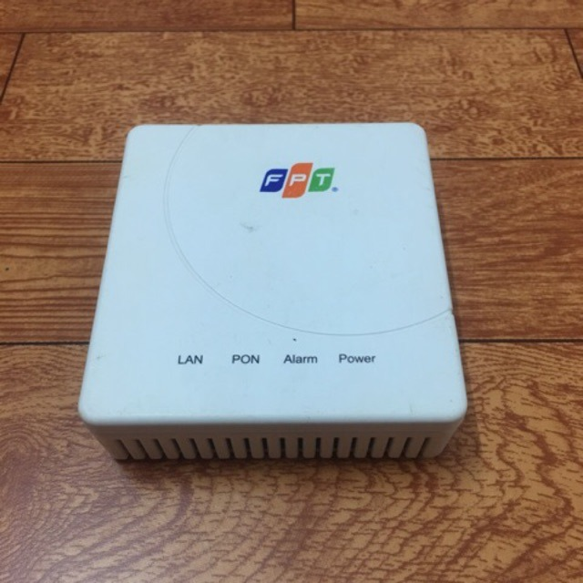
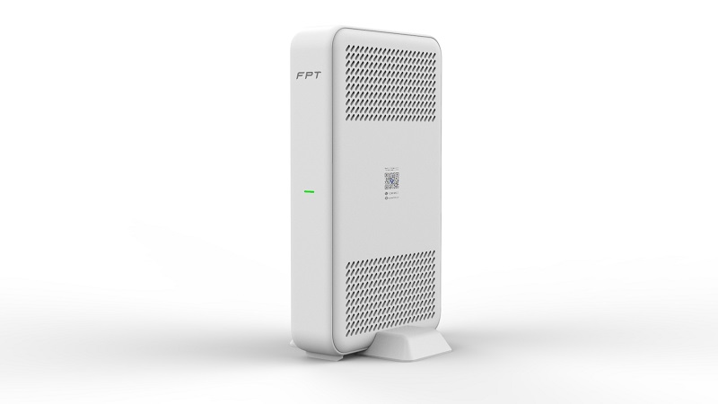
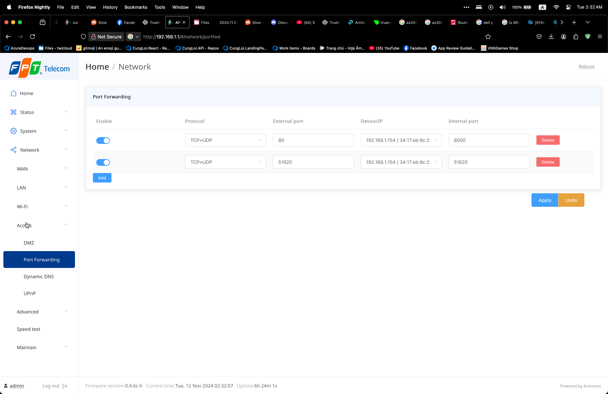
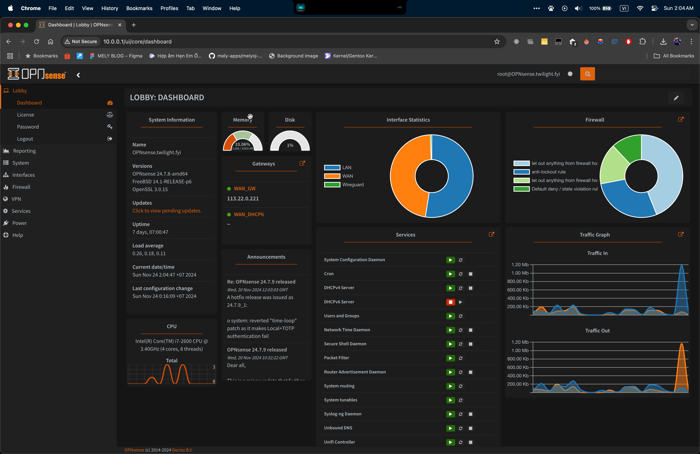
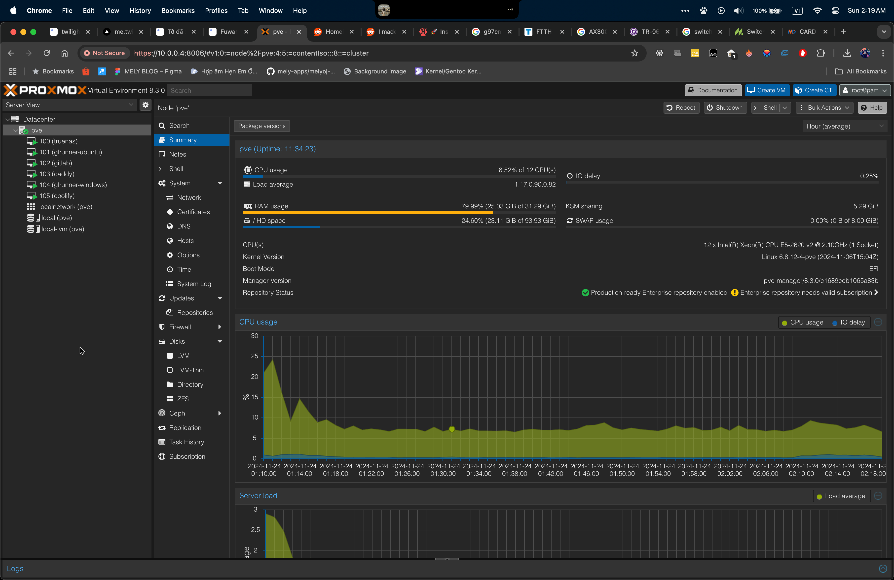
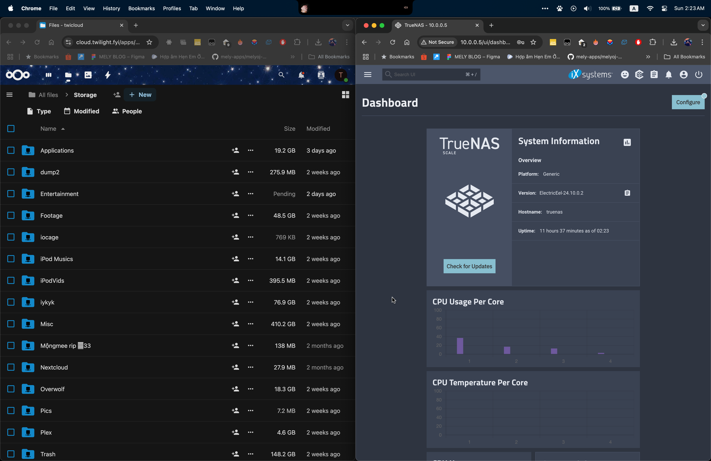
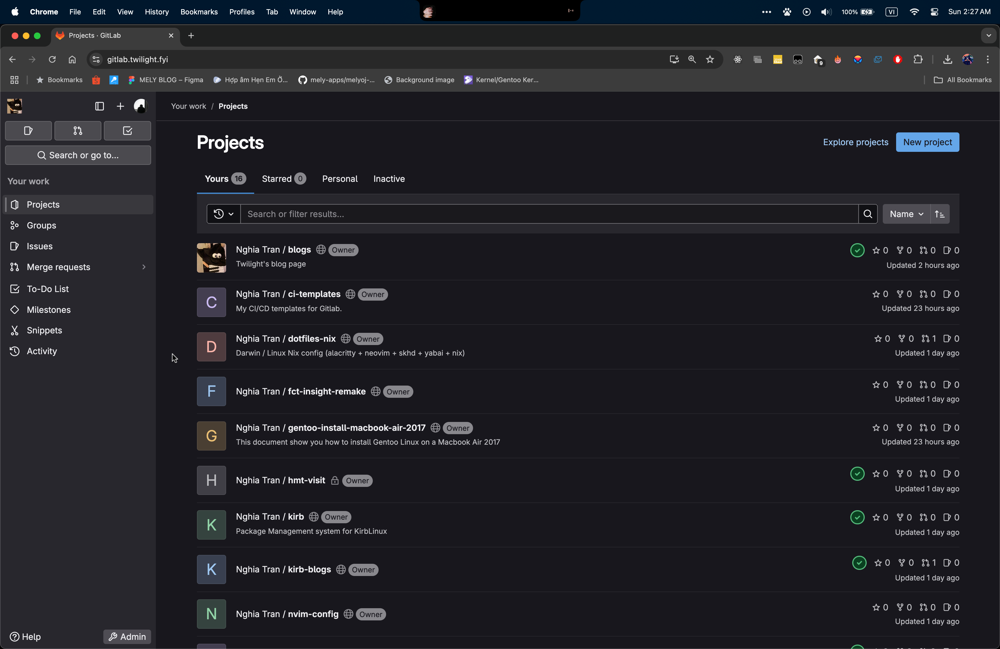
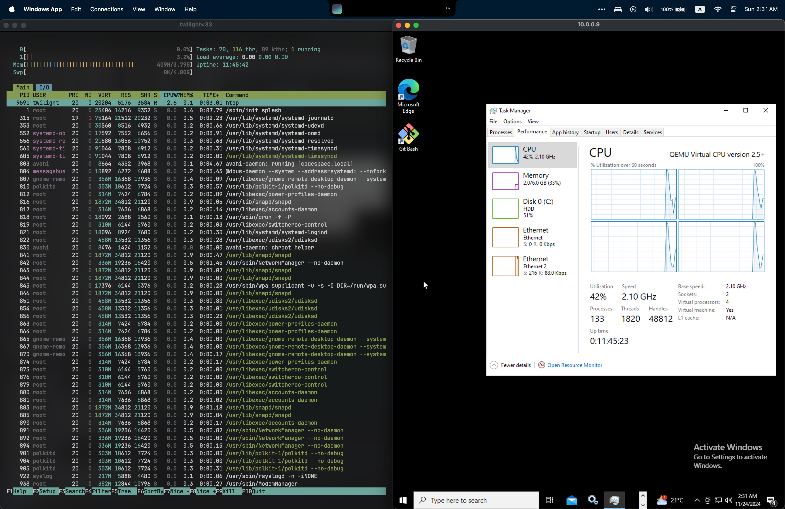
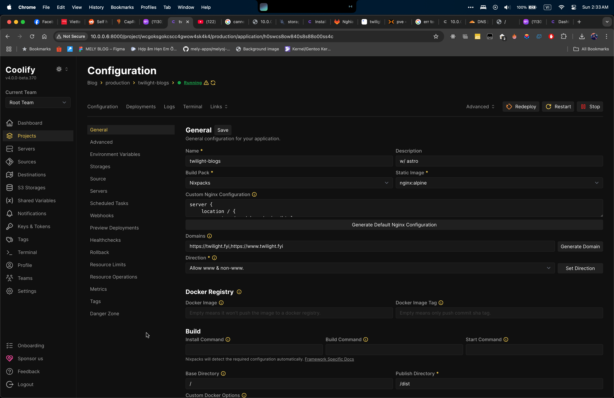
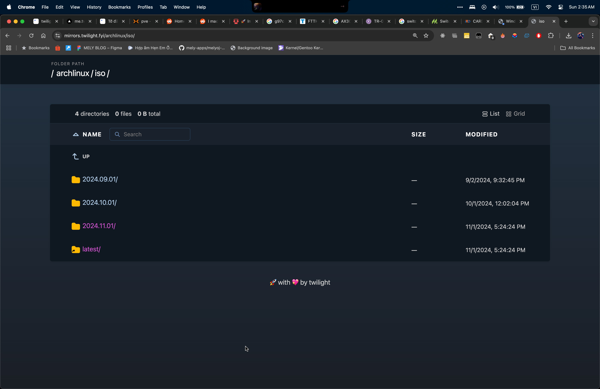

# Xin chào các cậu.

Trong bài blog post này, tớ sẽ chia sẻ về cách mình đã xây dựng về duy trì hệ thống Homelab của mình như thế nào, cũng như một số Tips và Tricks nha.

Trước khi bắt đầu, tớ xin cảm ơn idol [normalperson](https://normankr07.carrd.co/) đã support tớ rất nhiều trong phần setup và testing ạ :orz:

Các cậu có thể sử dụng bài viết của tớ làm reference để có thể setup một mô hình giống của tớ. Nếu có gì sai, đừng ngần ngại Feedback cho tớ ạ. :3

Chúng ta cùng bắt đầu nha. 🔥

# Hệ thống mạng
Trong phần này, tớ sẽ giới thiệu về tất cả mọi thứ có trong hệ thống mạng của tớ.

## Những thứ tớ dùng của ISP
Tớ hiện đang dùng nhà mạng FPT, với gói Meta (1Gbps Symmetrical), và những thứ tớ được cung cấp thì khá cơ bản:
* Một chiếc ONT của nhà mạng (G97CM): Đây là thiết bị sẽ giúp tớ trong việc chuyển tín hiệu quang FTTH qua LAN

Với setup hiện tại, tớ vẫn đang sử dụng thiết bị này.
* Một chiếc router của nhà mạng (AX3000CV2): Đây là thiết bị sẽ giúp điều phối traffic giữa các kết nối local, cũng như điều hướng các IP không trong dải local.

Riêng với thiết bị này của ISP cung cấp, tớ đã quyết định bỏ đi và không sử dụng, cùng tìm hiểu tại sao nhé.

## Tại sao tớ không dùng Router được cung cấp bởi ISP

Như ở trên, tớ đã mention về việc mình không sử dụng thiết bị Router được cung cấp bởi ISP, nhưng có hai lý do chính khiến tớ đưa ra kết luận này, cùng nhìn qua từng cái một nhé.

### Firmware riêng của nhà mạng

Riêng đối với thiết bị AX3000CV2 được nhà mạng cung cấp cho tớ, bên trong chiếc router vẫn đang chạy hệ điều hành OpenWrt, nhưng nó đã được can thiệp vào khá sâu bởi FPT (hoặc là Actiontec), nên tớ đã mất đi hoàn toàn khả năng tuỳ biến.

### TR-069 và câu chuyện quyền riêng tư

TR-069 (aka Technical Report 069) là một giao thức quản lý mạng thông qua WAN CPE.

TR-069 sẽ bao gồm cấu hình bảo mật tự động và các chức năng quản lý CPE, thường giao tiếp bằng với ACS (Auto Configuration Server).

Hiểu nhanh, thì TR-069 sẽ cho nhà mạng quản lý router của mình từ xa, thực hiện mọi cấu hình và chuyển đổi.

Không biết mọi người sao, nhưng cá nhân mình hơi nhạy cảm về việc Data collection, cũng như Quyền riêng tư của bản thân, nên thiết bị này của nhà mạng không dành cho mình :/

Như vậy, với hai lý do ở trên, tớ đã quyết định không sử dụng thiết bị Router được cung cấp bởi nhà mạng, cùng xem qua lựa chọn Router của tớ nhé.

### Tự xây dựng Router của riêng mình

Nếu các cậu chưa biết thì, mọi thiết bị router trên thị trường cũng chỉ thực chất là một chiếc máy tính với cấu hình thấp, và chạy một hệ điều hành được tối ưu riêng cho nó.

Điều đó cũng đồng nghĩa với việc chúng ta có thể sử dụng bất cứ một chiếc máy tính nào để sử dụng như Router, và tớ đã đi theo con đường đó, cùng xem qua hệ thống Router của tớ nhé.

## Về chiếc Router của tớ

Tớ đang sử dụng một chiếc máy tính cũ, sử dụng CPU Intel i7-2600, cùng với 4GB RAM.

Nhưng có một chút vấn đề, chiếc máy tính này chỉ có một cổng LAN, mà chúng ta cần tối thiểu hai cổng để có thể sử dụng làm Router.

Với lý do đó, tớ đã pickup một chiếc card LAN PCIE của Intel, với 2 cổng LAN Gigabit.

Lắp ráp tất cả mọi thứ lại, chúng ta đã được một chiếc Router rồi, nhưng chúng ta vẫn còn thiếu hệ điều hành cho nó.

## OpnSense (và tại sao tớ không dùng Pfsense)
OpnSense là một hệ điều hành firewall khá nổi để sử dụng với mục đích build Router.

Trong khi research về các hệ điều hành cho chiếc Router của mình, tớ cũng đã thấy qua lựa chọn Pfsense, nhưng chỉ có một lý dơ cơ bản mà tớ không chọn Pfsense,
đó là việc bắt buộc đăng ký tài khoản Netgate để tải Pfsense.

Nhưng sau khi đã có OpnSense được cài đặt và chạy trên Router của tớ, tớ thấy mọi thứ vẫn vô cùng ổn định, và tớ có thể recommend hệ điều hành này cho mọi người.

Đây là giao diện của OpnSense (trong hệ thống của tớ):

Tớ xin phép sẽ không đi quá sâu về phần OpnSense này.

Như vậy, chúng ta đã xong chiếc router rồi, nhưng giờ làm sao để cắm các thiết bị khác?

## Switch mạng
Switch cũng sẽ là thiết bị giúp mình điều phối các traffic nội bộ trong mạng (trong trường hợp này là từ máy đến Router)

Switch có càng nhiều port thì có thể càng giúp bạn kết nối được nhiều thiết bị hơn, nhưng hãy chọn đúng những gì bạn cần để hạn chế tốn tiền nha.

Đối với tớ, hiện tớ đang sử dụng một chiếc Switch của TP-Link, với mã TL-SG1005D.

Tuy đây là một chiếc switch rẻ tiền, nhưng nó vẫn đáp ứng tốt các nhu cầu của tớ, với mức giá phải chăng

## Access Point
Đa phần các thiết bị mà chúng ta dùng hàng ngày đều sử dụng Wifi, với hệ thống build chỉ có Router và Switch, chúng ta sẽ không có được các kết nối mạng không dây, và Access Point là gì mình cần để có thể cấu hình được mạng không dây.

Tớ đang sử dụng một chiếc Access Point của Ubiquiti, với mã là Unifi 6 Plus.

Giá của chiếc Access Point này cũng cao hơn so với các Router trên thị trường, tại nó được aim tới các doanh nghiệp, hơn là với người dùng cá nhân.

Nhưng chiếc Router này cũng đã giúp tớ Max out được băng thông của gói internet ở mức ~950Mbps Up/Down (Wifi 6, 160MHz).

# Hệ thống server chính

Có lẽ đây là linh hồn của Homelab của tớ, trên một chiếc máy này, nhưng nó đang host cực kỳ nhiều dịch vụ để tớ sử dụng, cùng xem có gì nhé.

## Những gì bên trong
Với hệ thống này, bên trong tớ sẽ có những thứ sau
* Xeon E5-2620 v2 (6 cores, 12 threads)
* 32GB RAM ECC
* RX 570
* Card RAID LSI 9261 (2 port SAS)
    * 2x WD RED Plus 4TB
* Samsung 870 EVO 500GB

## Proxmox
Chạy trên những phần cứng đó, tớ hiện đang sử dụng Proxmox làm hypervisor chính. Nó hiện đang giúp tớ chạy các máy ảo trong mô hình deploy của mình.

## TrueNAS
Đây sẽ là thứ chính giúp tớ chạy hệ thống NAS, giúp tớ backup hệ thống chính hàng ngày, cũng như là kho lưu trữ file.

Trên TrueNAS, tớ chỉ chạy một plugin duy nhất là Nextcloud, giúp tớ chia sẻ các file trong NAS của mình cho người khác đơn giản hơn, thông qua giao diện Web.

## GitLab
GitLab là nơi tớ hiện sử dụng để lưu trữ mã nguồn, cũng như luyện tập kỹ năng DevOps của mình.

Đây cũng là nơi tớ sẽ đăng tải một số các dự án cá nhân tiếp theo, đồng thời các dự án đó cũng sẽ được mirror qua GitHub.

## GitLab Runner 
Đối với các hoạt động CI/CD, tớ sẽ phải tự cung cấp riêng hệ thống để phục vụ quá trình build.

Trong trường hợp này, tớ sẽ sử dụng một máy ảo Windows và Linux để chạy GitLab Runner.

## Coolify
Coolify là hệ thống sẽ giúp tớ deploy các app mà không cần dựa vào Vercel hay các dịch vụ bên thứ ba khác.

## Caddy
Và để tất cả mọi thứ tớ host ở trên truy cập được, tớ sử dụng Caddy, để làm reverse proxy cho các trang web, cũng như để làm file browser cho mirror OSS của tớ.

# Kết thúc
Và đó là phần giới thiệu nhanh về hệ thống Homelab của tớ, nếu có thắc mắc, các cậu có thể liên hệ với tớ qua thông tin trong phần [Về tớ](http://twilight.fyi/about/).

Tớ cảm ơn các cậu đã đọc qua bài viết ạa.

